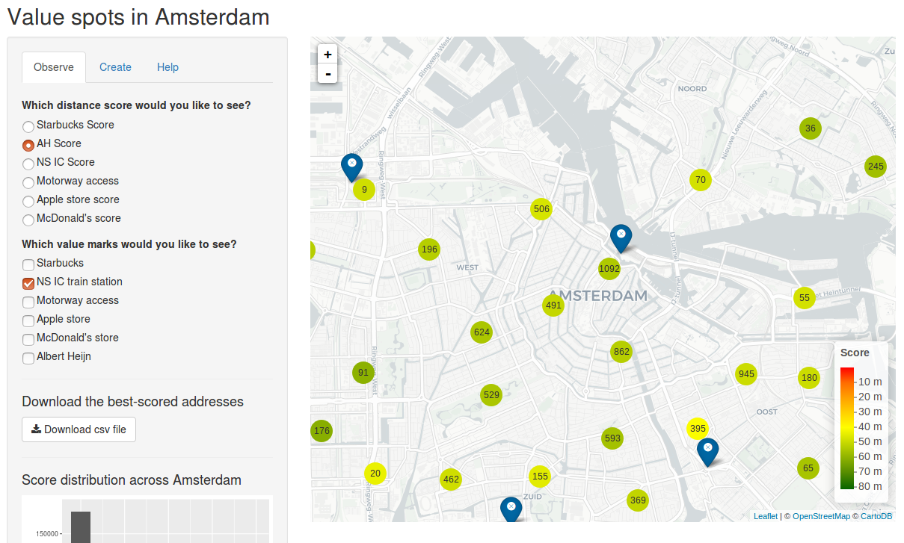

# Amsterdam value spots

With this app, you can easily find out where in Amsterdam the true valueable spots for housing are. 

Try the app on shinyapps.io:
[https://research-engineer.shinyapps.io/valuespotter_app/](https://research-engineer.shinyapps.io/valuespotter_app/)

## Distance scores

This works by measuring the distance between each building and certain value marks, such as the closest Starbucks store or the closest access to the motorway.

These "distance scores" tell you exactly which streets and buildings match your needs.

## Create your custom score

You can also combine your custom needs and create your individual score. By calculating the weighted mean distance for a multitude of value marks, the app will help you find your perfect spot to live.

## Data sources

[NL Extract](https://data.nlextract.nl/bag/csv/): The locations of houses and addresses were taken from this dataset (as of November 8, 2017).

## Future to-do's

* Include the code for generating the initial distance variables (such as Starbucks distance and NS IC train station distance).

* Add more data for the heatmap (currently limited to Amsterdam city).

* Increase app performance when using a high raster resolution.

* Make the UX more intuitive (particularly the creation of the custom score).

* Improve documentation.
